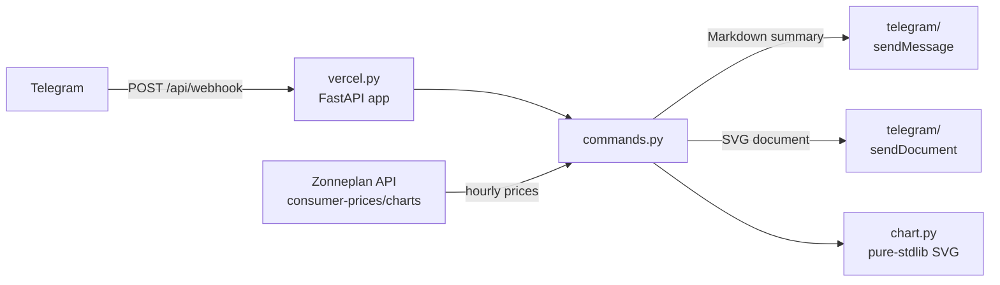

# ⚡ zonneplan-telegram

Fetches the hourly electricity prices from the [Zonneplan](https://www.zonneplan.nl) consumer API, serves them on demand through a Telegram bot and archives the price history as one JSON file per day.

The bot is deployed as a [Vercel Function](https://vercel.com/docs/functions) that receives Telegram updates through a webhook, so commands are answered immediately instead of being pushed by a scheduled workflow. Messages are in English and prices are reported in `ct/kWh`, the unit used by the Zonneplan app.

## Commands

| Command | Reply |
| --- | --- |
| `/priceNow` | Tariff of the current hour, plus today's min / max / average |
| `/priceTomorrow` | Tomorrow's min / max / average with the hours of the cheapest and most expensive slot, or a notice while the prices are not published yet |
| `/chart` | The Zonneplan bar chart, sent as an SVG document |
| `/help` (and `/start`) | The list of commands |

Matching is case-insensitive and tolerates the `@botusername` suffix, so `/priceNow`, `/pricenow` and `/priceNow@MyBot` all work. Updates from chats that are not in the allowlist are ignored.

## How it works



Two entrypoints share the same building blocks.

**`vercel.py` — the webhook (`POST /api/webhook`)**

1. **Verify** — the `X-Telegram-Bot-Api-Secret-Token` header is compared with `TELEGRAM_WEBHOOK_SECRET`, and updates from chats outside the allowlist are dropped.
2. **Dispatch** — `commands.py` maps the command to a handler that fetches the prices and replies in the chat that asked.

**`bot.py` — the scheduled report (`main()`, unchanged)**

1. **Fetch** — `get_zonneplan_hourly_prices()` calls `GET /api/consumer-prices/charts/electricity-hourly` and parses the payload into `APIResponse`.
2. **Archive** — `PriceStorage.save_prices()` groups the prices by local date and writes/updates `data/YYYY-MM-DD.json`.
3. **Notify** — `APIResponse.as_markdown()` renders the current tariff plus today's and tomorrow's min/max/average, which is sent with `sendMessage`.
4. **Chart** — `generate_zonneplan_bar_chart()` renders a Zonneplan-style bar chart (grey bars for hours already elapsed, green for the current hour and the future) and sends it with `sendDocument`.

## Requirements

- Python >= 3.12 (CI runs 3.14)
- [uv](https://docs.astral.sh/uv/) for dependency management and execution
- A Telegram bot token and the target chat id

## Installation

```bash
git clone https://github.com/Crissal1995/zonneplan-telegram.git
cd zonneplan-telegram
uv sync
```

## Configuration

The credentials are read from the environment at runtime:

| Variable | Required | Description |
| --- | --- | --- |
| `TELEGRAM_BOT_TOKEN` | yes | Bot token issued by [@BotFather](https://t.me/BotFather) |
| `TELEGRAM_CHAT_ID` | yes | Chat, group or channel id that receives the scheduled report; also the default allowlist |
| `TELEGRAM_ALLOWED_CHAT_IDS` | no | Comma-separated chat ids the webhook may answer. Falls back to `TELEGRAM_CHAT_ID` when unset |
| `TELEGRAM_WEBHOOK_SECRET` | recommended | Secret that Telegram echoes back in the `X-Telegram-Bot-Api-Secret-Token` header. When unset, every caller is accepted |

An empty allowlist means the bot answers nobody, so `TELEGRAM_CHAT_ID` or `TELEGRAM_ALLOWED_CHAT_IDS` must be set for the commands to work.

For local development, create a `.env` file in the repository root — it is loaded automatically when `python-dotenv` is installed (it is part of the `dev` dependency group):

```dotenv
TELEGRAM_BOT_TOKEN=123456:ABC-DEF...
TELEGRAM_CHAT_ID=123456789
TELEGRAM_ALLOWED_CHAT_IDS=123456789,-1001234567890
TELEGRAM_WEBHOOK_SECRET=some-random-string
```

Both `send_telegram_message()` and `send_telegram_document()` also accept explicit `bot_token` / `chat_id` arguments that take precedence over the environment.

## Deploying to Vercel

The repository needs no build step: Vercel detects the FastAPI app from the `fastapi` dependency in `pyproject.toml`, and `[tool.vercel] entrypoint` in the same file points at `zonneplan_telegram.vercel:app`. Steps that have to be done once, outside the repository:

1. **Import the project.** In the [Vercel dashboard](https://vercel.com/new), import the GitHub repository. Leave *Root Directory* at the repository root and keep the detected **FastAPI** framework preset.
2. **Add environment variables.** In *Project Settings → Environment Variables*, add `TELEGRAM_BOT_TOKEN`, `TELEGRAM_CHAT_ID`, `TELEGRAM_ALLOWED_CHAT_IDS` and `TELEGRAM_WEBHOOK_SECRET` for the Production (and optionally Preview) environment.
3. **Deploy** and note the production URL, e.g. `https://zonneplan-telegram.vercel.app`.
4. **Register the webhook** from a local checkout, once per deployment URL:

   ```bash
   uv run set-webhook https://zonneplan-telegram.vercel.app
   ```

   This calls `setWebhook` (with `secret_token` when `TELEGRAM_WEBHOOK_SECRET` is set) and `setMyCommands`, so the commands also appear in the Telegram menu.
5. **Verify** the registration:

   ```bash
   uv run set-webhook --info          # current webhook status
   uv run set-webhook --delete        # remove it again
   ```

`vercel.json` pins the function to the Amsterdam region (`ams1`), allows up to 30 seconds for chart rendering and keeps `data/`, `.github/` and the Markdown files out of the bundle.

### What still runs on GitHub Actions

The Vercel filesystem is read-only apart from `/tmp`, so the webhook never writes to `data/`. The scheduled `push.yaml` workflow keeps archiving the price history and committing it back to the repository, while Vercel only serves the on-demand commands.

## Usage

The on-demand Telegram commands are served by the deployed Vercel Function, so register its webhook first (see [Deploying to Vercel](#deploying-to-vercel)). To reproduce what the scheduled workflow does — send the full report and archive the prices — run the CLI locally from the repository root:

```bash
uv run zonneplan_telegram
```

The console script maps to `zonneplan_telegram.bot:main` (see `[project.scripts]` in `pyproject.toml`). Equivalent invocations:

```bash
uv run python -m zonneplan_telegram.bot
uv run -m zonneplan_telegram.bot   # uv's --module flag
```

Run `uv run -m zonneplan_telegram` (without `.bot`) only imports the package: the package has no `__main__.py`.

In CI the run is pinned and dev dependencies are excluded:

```bash
UV_FROZEN=1 UV_NO_DEV=1 uv run zonneplan_telegram
```

## Data storage

Price history is written to `data/`, relative to the current working directory, with one file per **local** day:

```json
{
  "2026-09-29T00:00:00+00:00": {
    "start_date": "2026-09-29T00:00:00+00:00",
    "end_date": "2026-09-29T01:00:00+00:00",
    "amount": 3360943.0
  }
}
```

- Keys are the UTC ISO-8601 start timestamps; the filename uses the local date.
- `amount` is the raw API value. `Price.price_eur` converts it with a `1e-7` factor and `Price.price_cents` with `1e-5`, so the example above is `33.61 ct/kWh`.
- An existing day file is only rewritten when the newly fetched data contains **more entries** than the stored file, so already-recorded hours are not overwritten.
- A missing file (or one that fails to parse) is treated as an empty history and reported through `loguru`; the run continues.

## Development

Quality gates are managed with [tox](https://tox.wiki) and the `tox-uv` plugin:

| Environment | Purpose | Commands |
| --- | --- | --- |
| `tox -e lint` | Linting | `ruff check` |
| `tox -e format` | Formatting check | `ruff format --check` |
| `tox -e type` | Type checking | `ty check` |
| `tox -e fix` | Auto-fixes | `ruff format`, `ruff check --fix`, `ty check --fix` |
| `tox` | All three checks | `lint`, `format`, `type` |

```bash
uv tool install tox --with tox-uv
tox          # run every qualification environment
tox -e fix   # apply automatic fixes
```

Ruff is configured with `line-length = 120` and `select = ["ALL"]`, ignoring copyright rules (`CPY`), the comma rule that conflicts with the formatter (`COM812`) and docstring rules (`D`).

### Continuous integration

| Workflow | Trigger | What it does |
| --- | --- | --- |
| `qualify.yaml` | `pull_request` | Runs `tox` (lint, format check, type check) |
| `push.yaml` | `workflow_dispatch` | Runs the bot, then commits the new data through an auto-merged pull request |

`push.yaml` needs the `PAT` secret (a token with `repo` scope; the job already declares `contents: write` and `pull-requests: write`) and the two Telegram secrets. It runs the bot, closes any still-open pull request on the `automated-data-update` branch, opens a fresh one with `peter-evans/create-pull-request`, approves and squash-merges it with `--admin`. The approval and merge steps are skipped when no data changed and therefore no pull request was created.

## Project structure

```
.
├── .github/workflows/
│   ├── qualify.yaml              # PR quality gate (tox)
│   └── push.yaml                 # run the bot + auto-merge data updates
├── data/                         # archived price history (one JSON per day)
├── src/zonneplan_telegram/
│   ├── bot.py                    # scheduled CLI: fetch → archive → send
│   ├── vercel.py                 # Vercel entrypoint: FastAPI webhook
│   ├── commands.py               # command handlers + Telegram menu metadata
│   ├── chart.py                  # pure-stdlib SVG bar chart
│   ├── storage.py                # per-day JSON persistence
│   ├── api/
│   │   ├── __init__.py           # API base URL
│   │   └── hourly_prices/
│   │       ├── __init__.py       # HTTP calls (hourly & quarter-hourly)
│   │       └── model.py          # pydantic models + Markdown rendering
│   └── telegram/
│       ├── __init__.py           # sendMessage / sendDocument clients + allowlist
│       ├── models.py             # minimal Update / Message / Chat models
│       └── set_webhook.py        # `set-webhook` CLI (setWebhook + setMyCommands)
├── pyproject.toml                # metadata, deps, vercel entrypoint, ruff & tox config
├── vercel.json                   # region, duration and bundle exclusions
└── uv.lock
```

## API endpoints

Base URL: `https://app-api.zonneplan.nl/api`

- `GET /consumer-prices/charts/electricity-hourly` — used by the bot
- `GET /consumer-prices/charts/electricity-quarter-hourly` — available via `get_zonneplan_quarter_hourly_prices()`

## Notes

- `data/` and `chart.svg` are resolved relative to the working directory, so run the `bot.py` CLI from the repository root.
- `chart.py` assembles the SVG from plain strings, so neither matplotlib nor numpy is deployed and `/chart` has no heavy import to pay for on a cold start.
- Telegram only renders raster images through `sendPhoto`, so `/chart` delivers the SVG with `sendDocument`: it arrives as a file that opens in the Telegram viewer instead of an inline image.
- `/chart` writes its SVG to `/tmp`, the only writable location on Vercel.
